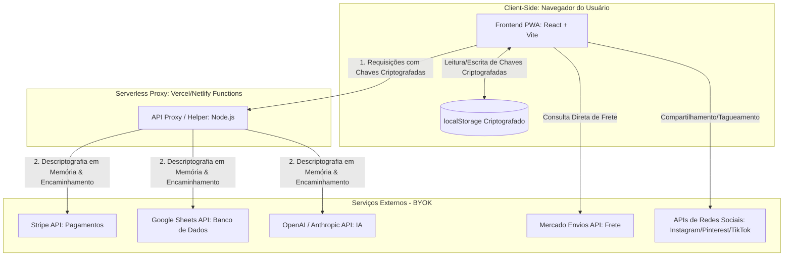

# Solution Architecture — CapybaraCart

Este documento descreve a arquitetura técnica, a topologia de componentes, os fluxos de dados e as estratégias de resiliência do CapybaraCart, seguindo a "Filosofia Fusca" (simplicidade, robustez e modularidade) e o modelo descentralizado BYOK (Bring Your Own Key).

---

## 1. Diagrama de Componentes de Alto Nível

O diagrama abaixo ilustra a interação entre o navegador do usuário (comprador ou vendedor), o proxy serverless intermediário (stateless) e as APIs externas de terceiros configuradas sob o modelo BYOK.

---

## 2. Descrição Textual dos Componentes

### 2.1 Frontend PWA (React + Vite + Tailwind CSS)
*   **Papel:** Interface única para o vendedor (Dashboard, Setup BYOK, Cadastro de Produtos) e para o comprador (Vitrine de Produto, Checkout de Passo Único).
*   **Tecnologias Recomendadas:** React, Vite, Tailwind CSS e Workbox para suporte offline.
*   **Comunicação:** Envia requisições ao Serverless Proxy com as chaves criptografadas do seller.

### 2.2 Armazenamento Local (localStorage Criptografado)
*   **Papel:** Armazenar as chaves de API do seller (Stripe, Google Sheets, OpenAI/Anthropic) no dispositivo do vendedor.
*   **Segurança:** Criptografia simétrica AES-GCM-256 baseada em senha mestre local.

### 2.3 Serverless Proxy / Helper (Vercel / Netlify Functions)
*   **Papel:** Proxy stateless de passagem segura para evitar CORS e proteger chaves privadas no client-side.
*   **Tecnologias Recomendadas:** Node.js em ambiente Serverless.

### 2.4 Serviços Externos (BYOK)
*   **Stripe API:** Processamento de pagamentos.
*   **Google Sheets API:** Banco de dados descentralizado de pedidos.
*   **OpenAI / Anthropic API:** Processamento de linguagem natural para os assistentes.
*   **Mercado Envios API:** Cálculo dinâmico de frete.

---

## 3. Fluxo de Dados (Data Flows)

### 3.1 Fluxo de Setup
1. O seller insere as chaves e define uma Senha Mestre local.
2. O PWA deriva uma chave via PBKDF2 e criptografa as credenciais com AES-GCM-256.
3. As chaves criptografadas são salvas no `localStorage`.

### 3.2 Fluxo de Compra e Checkout
1. O comprador acessa a vitrine, calcula o frete e preenche o checkout de passo único.
2. O PWA envia os dados e as chaves criptografadas do seller para o Serverless Proxy.
3. O proxy descriptografa as chaves em memória, processa o pagamento no Stripe e grava o pedido no Google Sheets do seller.

### 3.3 Fluxo de Assistente de IA
1. O seller interage com o assistente de cadastro.
2. O PWA envia o prompt e a chave criptografada de IA para o proxy.
3. O proxy descriptografa a chave, consulta a API de LLM e retorna a resposta estruturada.

---

## 4. Decisões de Escala, Performance e Custo

*   **Custo Operacional Zero:** Arquitetura Jamstack estática com proxy serverless que elimina servidores dedicados e bancos de dados centralizados.
*   **Escalabilidade:** Distribuição global via CDN e execução sob demanda de funções serverless.

---

## 5. Pontos de Falha e Resiliência (Failure Modes)

*   **Falha no Google Sheets:** O pagamento é processado e o pedido é salvo temporariamente no IndexedDB do seller para sincronização posterior.
*   **Falha no Stripe:** O checkout exibe erro amigável e bloqueia a gravação no Sheets.
*   **Falha na API de LLM:** O assistente é desativado suavemente, permitindo o cadastro manual.