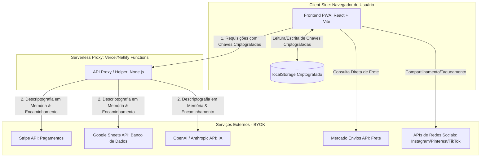

# Solution Architecture — CapybaraCart

Este documento descreve a arquitetura técnica, a topologia de componentes, os fluxos de dados e as estratégias de resiliência do CapybaraCart, seguindo a "Filosofia Fusca" (simplicidade, robustez e modularidade) e o modelo descentralizado BYOK (Bring Your Own Key).

---

## 1. Diagrama de Componentes de Alto Nível

O diagrama abaixo ilustra a interação entre o navegador do usuário (comprador ou vendedor), o proxy serverless intermediário (stateless) e as APIs externas de terceiros configuradas sob o modelo BYOK.

---

## 2. Descrição Textual dos Componentes

### 2.1 Frontend PWA (React + Vite + Tailwind CSS)
*   **Papel:** Interface única para o vendedor (Dashboard, Setup BYOK, Cadastro de Produtos) e para o comprador (Vitrine de Produto, Checkout de Passo Único).
*   **Tecnologias Recomendadas:** React (pela maturidade e ecossistema), Vite (para builds rápidos e leves), Tailwind CSS (para estilização utilitária de alta performance) e Workbox (para suporte a Service Workers e cache offline).
*   **Comunicação:** Comunica-se com o *Serverless Proxy* enviando payloads de dados acompanhados das chaves de API criptografadas do seller.

### 2.2 Armazenamento Local (localStorage Criptografado)
*   **Papel:** Armazenar as chaves de API do seller (Stripe, Google Sheets, OpenAI/Anthropic) diretamente no dispositivo do vendedor.
*   **Segurança:** As chaves nunca são salvas em texto puro. Elas são criptografadas no client-side usando o algoritmo **AES-GCM-256** com uma chave derivada da senha mestre do seller (via PBKDF2).

### 2.3 Serverless Proxy / Helper (Vercel / Netlify Functions)
*   **Papel:** Atuar como um duto de passagem (pass-through proxy) seguro e totalmente stateless. Ele resolve problemas de CORS e evita a exposição de chaves de API privadas no tráfego de rede do comprador final.
*   **Tecnologias Recomendadas:** Node.js rodando em ambiente Serverless (Vercel Functions ou AWS Lambda).
*   **Comunicação:** Recebe a requisição do PWA contendo o payload e as chaves criptografadas, descriptografa as chaves temporariamente em memória volátil de execução, realiza a chamada HTTP segura para o serviço de terceiro (Stripe, Sheets, OpenAI) e retorna a resposta diretamente ao PWA, limpando a memória em seguida.

### 2.4 Serviços Externos (BYOK)
*   **Stripe API:** Processamento de pagamentos via cartão de crédito ou Pix.
*   **Google Sheets API:** Utilizado como o banco de dados descentralizado do seller. Cada venda gera uma nova linha na planilha do vendedor.
*   **OpenAI / Anthropic API:** Processamento de linguagem natural para os assistentes de setup, cadastro de produtos e posts sociais.
*   **Mercado Envios API:** Cálculo dinâmico de frete e prazos de entrega com base no CEP do comprador.
*   **APIs de Redes Sociais:** Integração para publicação de posts e tagueamento de produtos nas vitrines do Instagram, Pinterest e TikTok.

---

## 3. Fluxo de Dados (Data Flows)

### 3.1 Fluxo de Setup (Salvamento Seguro de Chaves)
1.  O seller acessa a tela de Setup BYOK e insere suas chaves de API (Stripe, Google Sheets, OpenAI).
2.  O seller define uma **Senha Mestre** local.
3.  O PWA utiliza a API de criptografia nativa do navegador (`Web Crypto API`) para derivar uma chave criptográfica a partir da Senha Mestre usando PBKDF2.
4.  O PWA criptografa as chaves de API usando **AES-GCM-256**.
5.  As chaves criptografadas são salvas no `localStorage` do navegador do seller.
6.  *Nota de Segurança:* A Senha Mestre nunca é salva no localStorage; o seller deve digitá-la para descriptografar as chaves ao iniciar uma nova sessão de edição ou cadastro.

### 3.2 Fluxo de Compra e Checkout (Armazenamento Zero)
1.  O comprador acessa a vitrine PWA do produto (o link contém o ID do produto e o identificador público do seller).
2.  O comprador insere o CEP; o PWA consulta a API do Mercado Envios para calcular o frete.
3.  O comprador preenche os dados de entrega e os dados do cartão de crédito (via Stripe Elements, garantindo que os dados do cartão nunca toquem o código do CapybaraCart).
4.  O PWA envia uma requisição para o *Serverless Proxy* contendo: dados do pedido, dados de entrega e as chaves criptografadas do Stripe e Google Sheets do seller (recuperadas da vitrine pública).
5.  O *Serverless Proxy* descriptografa as chaves em memória usando a chave de sessão temporária.
6.  O proxy chama a API do Stripe para criar e confirmar o `PaymentIntent`.
7.  Após a aprovação do pagamento, o proxy chama a API do Google Sheets para inserir uma nova linha com os dados do comprador e do pedido.
8.  O proxy retorna o status de sucesso para o PWA do comprador, que exibe a tela de confirmação.

### 3.3 Fluxo de Assistente de IA
1.  O seller interage com o assistente de cadastro de produtos no dashboard.
2.  O PWA envia o prompt do usuário juntamente com a chave criptografada da OpenAI/Anthropic do seller para o *Serverless Proxy*.
3.  O proxy descriptografa a chave de IA em memória.
4.  O proxy faz a chamada para a API da OpenAI/Anthropic (ex: modelo `gpt-4o-mini` ou `claude-3-5-haiku`).
5.  O proxy recebe a resposta estruturada e a repassa para o PWA do seller.
6.  O seller revisa, edita e salva o conteúdo gerado.

---

## 4. Decisões de Escala, Performance e Custo

### 4.1 Custo Operacional Próximo a Zero ($0)
Ao adotar uma arquitetura Jamstack (PWA estático + Serverless Proxy), o CapybaraCart elimina a necessidade de servidores dedicados ativos 24/7 e bancos de dados relacionais centralizados. A hospedagem do frontend e a execução das funções serverless cabem perfeitamente nos limites gratuitos (Free Tier) de plataformas como Vercel ou Netlify. Toda a carga financeira de processamento de pagamentos e consumo de tokens de IA é distribuída diretamente para as contas individuais dos sellers (BYOK).

### 4.2 Escalabilidade Infinita
Como o frontend é distribuído via redes de entrega de conteúdo (CDNs) globais, o carregamento da vitrine do produto é extremamente rápido e imune a picos de tráfego (ex: quando a Mariana lança um "drop" de roupas e recebe milhares de acessos simultâneos vindos do Instagram). As funções serverless escalam horizontalmente de forma automática para processar múltiplos checkouts simultâneos.

---

## 5. Pontos de Falha e Resiliência (Failure Modes)

| Ponto de Falha | Impacto | Comportamento do Sistema / Mitigação |
|---|---|---|
| **API do Google Sheets fora do ar ou com Rate Limit** | Alto (Risco de perda de dados do pedido do comprador) | **Mitigação:** O pagamento no Stripe é processado com sucesso. O *Serverless Proxy* detecta a falha do Sheets e salva o payload do pedido criptografado em uma fila de contingência local (IndexedDB do navegador do seller) ou em um banco de dados de passagem temporário. Quando o seller abre o dashboard, o sistema alerta sobre a falha e realiza a sincronização manual/automática assim que a API do Google Sheets restabelecer a conexão. |
| **API do Stripe falha na confirmação** | Crítico (Pagamento não processado) | **Mitigação:** O checkout exibe uma mensagem de erro clara instruindo o comprador a tentar novamente ou usar outro método de pagamento. Nenhuma linha é gravada no Google Sheets do seller, evitando pedidos sem pagamento correspondente. |
| **API de LLM (OpenAI/Anthropic) indisponível** | Baixo (Assistentes de IA inativos) | **Mitigação (Degradação Suave):** O PWA detecta a falha de conexão com a API de IA, exibe um aviso amigável informando que o assistente está temporariamente indisponível e libera o formulário de cadastro de produtos e escrita de posts para preenchimento 100% manual, sem travar a experiência do seller. |
| **Queda de conexão do comprador durante o checkout** | Médio (Incerteza sobre a conclusão da compra) | **Mitigação:** Implementação de idempotência nas requisições de pagamento do Stripe utilizando uma chave única gerada no início do checkout. Se o comprador reconectar e tentar reenviar o formulário, o Stripe evita a cobrança duplicada e retorna o status da transação original. |